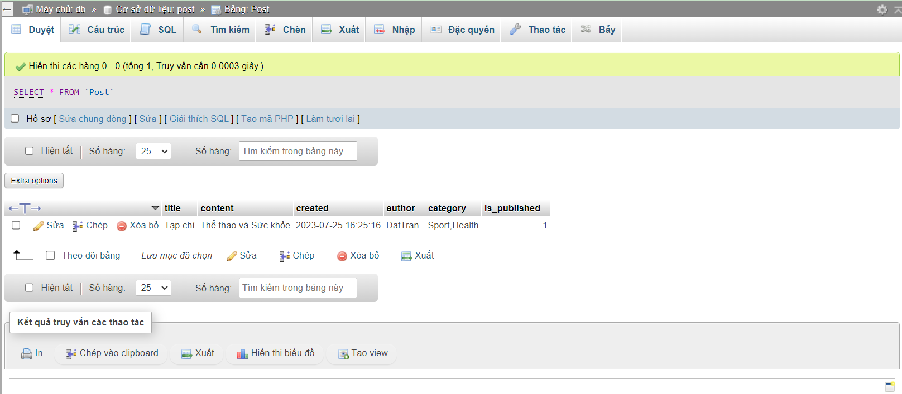
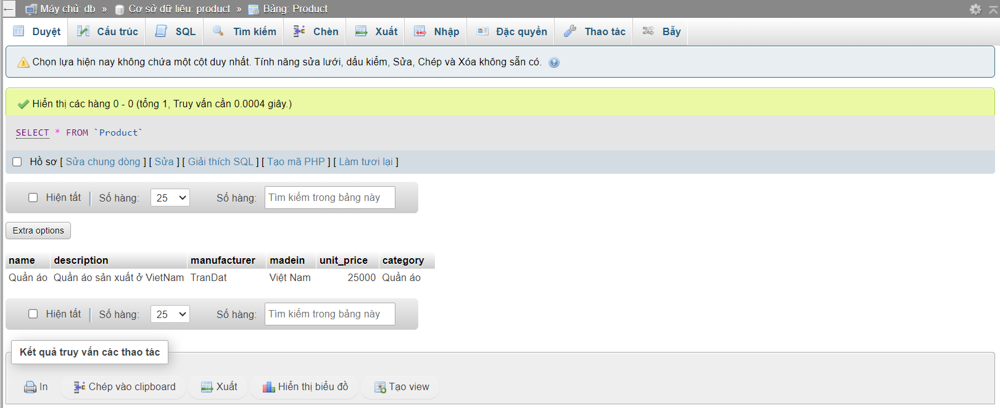

### Bài tập

Câu 1: Thiết kế bảng Post

```sql
CREATE TABLE Post(
    title VARCHAR(250),
	content TEXT,
	created  DATETIME,
	author VARCHAR(100),
	category  SET ('Sport', 'Politics', 'Health', 'Tourism', 'Economy', 'Education', 'Technology', 'Science'),
	is_published BOOLEAN
    );

SELECT * FROM `Post` WHERE 1;
INSERT INTO Post (title, content, created, author, category, is_published)
VALUES ('Tạp chí', 'Thể thao và Sức khỏe', '2023-07-25 16:25:16', 'DatTran', 'Sport,Health', TRUE);
```

Câu 2: Thiết kế bảng Product

```sql
CREATE TABLE Product(
	name VARCHAR(300),
	description TEXT,
	manufacturer VARCHAR(250),
	madein VARCHAR(100),
	unit_price INT,
	category SET('Quần áo', 'Mỹ phẩm', 'Đồ chơi', 'Dụng cụ học tập', 'Máy tính', 'Di động', 'Điện tự dân dụng', 'Văn phòng')
);

SELECT * FROM `Product` WHERE 1;
INSERT INTO	Product (name, description, manufacturer, madein, unit_price, category)
VALUES ('Quần áo', 'Quần áo sản xuất ở VietNam', 'TranDat', 'Việt Nam', 25000, 'Quần áo');

```


