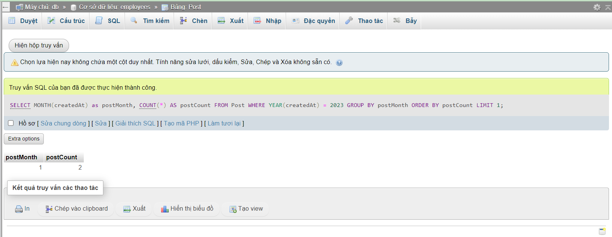

### Bài tập

Câu 1: Hiển thị các bài viết của Person làm nghề Programmer được tạo sau ngày 01/01/2023

```sql
SELECT * FROM Post po
JOIN Person p ON po.authorId = p.id	
WHERE createdAt > '2022-01-01' AND	p.job = 'Programmer';
```


Câu 2: Tính tổng số lượng bài Post trong năm 2022

```sql
SELECT COUNT(id) FROM Post
WHERE YEAR(createdAt) = 2022;
```


Câu 3: Hiển thị thông tin người dùng có bài Post trong năm 2022

```sql
SELECT pe.*  FROM `Person` pe 
JOIN Post po ON pe.id = po.authorId
WHERE YEAR(po.createdAt) = 2022;
```


Câu 4: Hiển thị thông tin người dùng và title bài Post của 3 bài post mới nhất

```sql
SELECT pe.*, po.title  FROM `Person` pe 
JOIN Post po ON pe.id = po.authorId
ORDER BY po.createdAt DESC LIMIT 3;
```


Câu 5: Thống kê số lượng bài Post của từng người

```sql
SELECT pe.fullname, COUNT(po.id)  FROM `Person` pe 
JOIN Post po ON pe.id = po.authorId
GROUP BY po.authorId;
```


Câu 6: Thống kê số lượng bài Post của những người ở China

```sql
SELECT pe.fullname, pe.country, COUNT(po.id)  FROM `Person` pe 
JOIN Post po ON pe.id = po.authorId
WHERE pe.country = 'China'
GROUP BY po.authorId
;
```


Câu 7: Thống kê số lượng bài Post của những người có sở thích Swimming trong năm 2023

```sql
SELECT pe.fullname, pe.hobbies , COUNT(po.id)  FROM `Person` pe 
JOIN Post po ON pe.id = po.authorId
WHERE pe.hobbies = 'Swimming' AND YEAR(po.createdAt) = 2023
GROUP BY po.authorId
;
```


Câu 8: Tìm kiếm tháng có nhiều bài post nhất trong năm 2023

```sql
SELECT MONTH(createdAt) as postMonth,  COUNT(*) AS postCount
FROM Post
WHERE YEAR(createdAt) = 2023
GROUP BY postMonth
ORDER BY postCount
LIMIT 1;
```



Câu 9: Tìm kiếm năm có ít bài post nhất

```sql
SELECT YEAR(createdAt) as year, COUNT(*) as total 
FROM Post
GROUP BY year 
ORDER BY total ASC
LIMIT 1;
```


Câu 10: Tìm kiếm năm có nhiều bài viết nhất

```sql
SELECT YEAR(createdAt) as year, COUNT(*) as total 
FROM Post
GROUP BY year 
ORDER BY total DESC	
LIMIT 1;
```


Câu 11: Hiển thị thông tin người dùng có nhiều bài post nhất trong năm 2023

```sql
SELECT pe.*, COUNT(po.id) AS total FROM Person pe 
JOIN Post po ON pe.id = po.authorId
GROUP BY pe.id
ORDER BY total DESC
LIMIT 1;
```


Câu 12: Hiển thị thông tin những người dùng có nhiều hơn 2 bài post trong năm 2022

```sql
SELECT pe.*, COUNT(po.id) AS total FROM Person pe 
JOIN Post po ON pe.id = po.authorId
GROUP BY pe.id
HAVING total > 2
ORDER BY total ASC;
```

