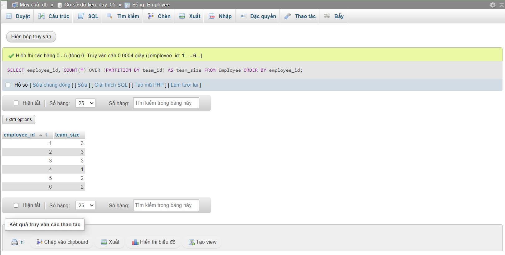
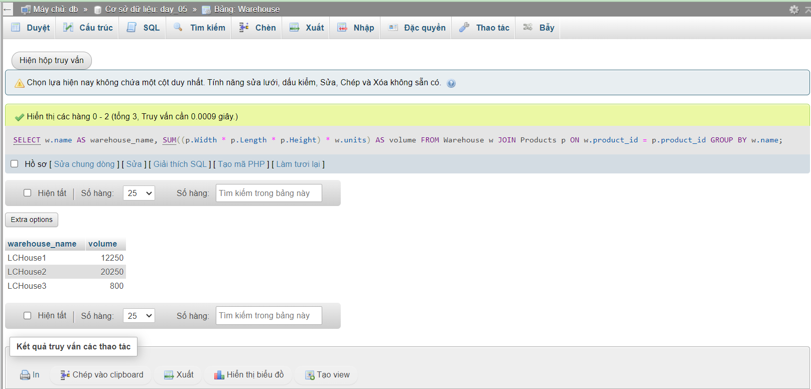
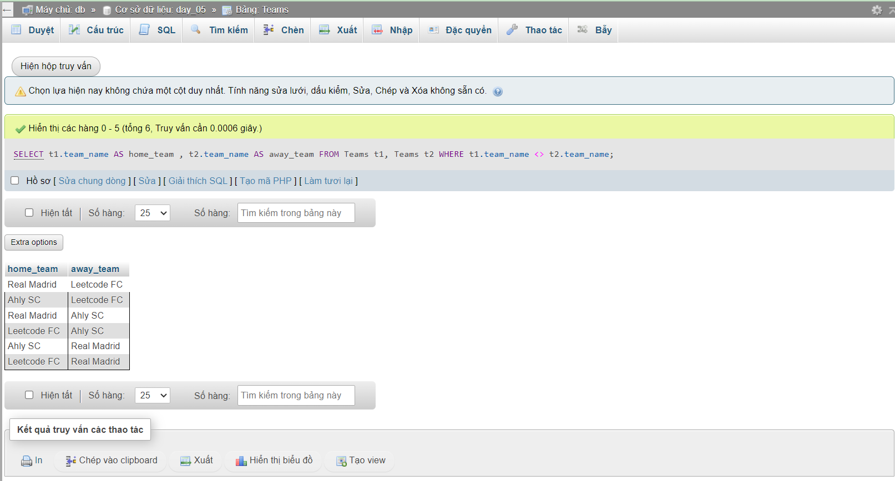
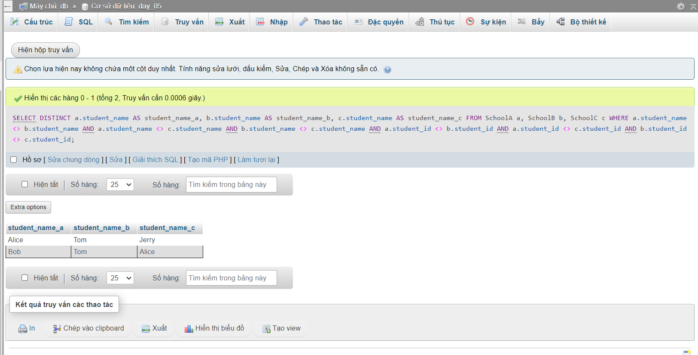
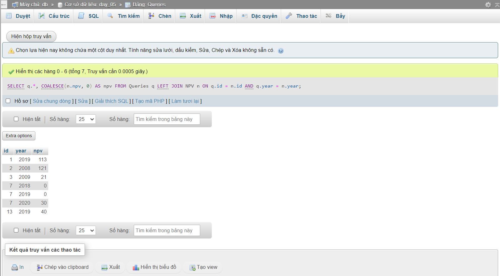

### Bài tập

1303. Find the Team Size

```sql
SELECT employee_id, COUNT(*) OVER (PARTITION BY team_id) AS team_size
FROM Employee
ORDER BY employee_id;
```



1571. Warehouse Manager

```sql
Create table If Not Exists Warehouse (name varchar(50), product_id int, units int);

Create table If Not Exists Products (product_id int, product_name varchar(50), Width int,Length int,Height int);
Truncate table Warehouse;
insert into Warehouse (name, product_id, units) values ('LCHouse1', 1, 1);
insert into Warehouse (name, product_id, units) values ('LCHouse1', 2, 10);
insert into Warehouse (name, product_id, units) values ('LCHouse1', 3, 5);
insert into Warehouse (name, product_id, units) values ('LCHouse2', 1, 2);
insert into Warehouse (name, product_id, units) values ('LCHouse2', 2, 2);
insert into Warehouse (name, product_id, units) values ('LCHouse3', 4, 1);
Truncate table Products;
insert into Products (product_id, product_name, Width, Length, Height) values (1, 'LC-TV', 5, 50, 40);
insert into Products (product_id, product_name, Width, Length, Height) values (2, 'LC-KeyChain', 5, 5, 5);
insert into Products (product_id, product_name, Width, Length, Height) values (3, 'LC-Phone', 2, 10, 10);
insert into Products (product_id, product_name, Width, Length, Height) values (4, 'LC-T-Shirt', 4, 10, 20);

SELECT w.name AS warehouse_name, SUM((p.Width * p.Length * p.Height) * w.units) AS volume
FROM Warehouse w
JOIN Products p ON w.product_id = p.product_id
GROUP BY w.name;
```



2339. All the Matches of the League

```sql
SELECT t1.team_name AS home_team ,   t2.team_name AS away_team   
FROM Teams t1, Teams t2
WHERE t1.team_name <> t2.team_name;
```



1623. All Valid Triplets That Can Represent a Country

```sql
SELECT DISTINCT a.student_name AS student_name_a, b.student_name AS student_name_b, c.student_name AS student_name_c
FROM SchoolA a, SchoolB b, SchoolC c
WHERE a.student_name <> b.student_name AND a.student_name <> c.student_name AND b.student_name <> c.student_name AND a.student_id <> b.student_id AND a.student_id <> c.student_id AND b.student_id <> c.student_id;
```



1421. NPV Queries

```sql
SELECT q.*, COALESCE(n.npv, 0) AS npv FROM Queries q
LEFT JOIN NPV n ON q.id = n.id AND q.year = n.year;
```



1069. Product Sales Analysis II

```sql
SELECT product_id , SUM(quantity) AS total_quantity 
FROM Sales
GROUP BY product_id;
```