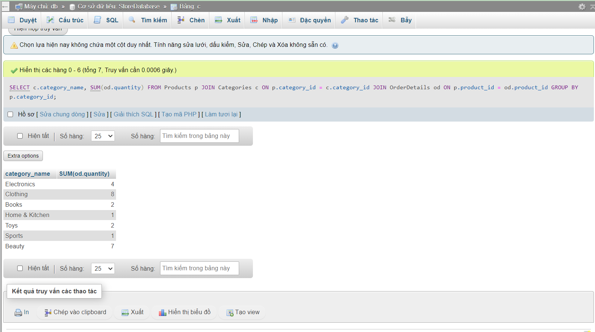

### Kiểm tra 

1. Lấy thông tin tất cả các sản phẩm đã được đặt trong một đơn đặt hàng cụ thể.

```sql
SELECT p.* FROM Products p
JOIN OrderDetails od ON p.product_id = od.product_id
JOIN Orders o ON od.order_id = o.order_id
WHERE o.order_id = 301;
```


2. Tính tổng số tiền trong một đơn đặt hàng cụ thể.

```sql
SELECT od.order_id, SUM(p.price * od.quantity) as total_price FROM OrderDetails od
JOIN Products p ON od.product_id = p.product_id
GROUP BY od.order_id;
```


3. Lấy danh sách các sản phẩm chưa có trong bất kỳ đơn đặt hàng nào.

```sql
SELECT p.* FROM Products p 
LEFT JOIN OrderDetails od ON p.product_id = od.product_id
WHERE od.order_id is null;
```


4. Đếm số lượng sản phẩm trong mỗi danh mục. (category_name, total_products)

```sql
SELECT c.category_name, SUM(p.quantity) as total_products FROM Products p 
JOIN Categories c ON p.category_id = c.category_id
GROUP BY p.category_id;
```


5. Tính tổng số lượng sản phẩm đã đặt bởi mỗi khách hàng (customer_name, total_ordered)

```sql
SELECT c.customer_name, SUM(od.quantity) FROM Orders o 
JOIN OrderDetails od ON o.order_id  = od.order_id
JOIN Customers c ON o.customer_id = c.customer_id 
GROUP BY o.customer_id;
```


6. Lấy thông tin danh mục có nhiều sản phẩm nhất (category_name, product_count)

```sql
SELECT c.*  FROM Products p 
JOIN Categories c ON p.category_id = c.category_id
GROUP BY p.category_id
ORDER BY SUM(p.quantity) DESC 
LIMIT 1;
```


7. Tính tổng số sản phẩm đã được đặt cho mỗi danh mục (category_name, total_ordered)

```sql
SELECT c.category_name, SUM(od.quantity)  FROM Products p
JOIN Categories c ON p.category_id = c.category_id
JOIN OrderDetails od ON p.product_id = od.product_id
GROUP BY p.category_id;
```



8. Lấy thông tin về top 3 khách hàng có số lượng sản phẩm đặt hàng lớn nhất (customer_id, customer_name, total_ordered)

```sql
SELECT c.customer_id, c.customer_name, SUM(od.quantity) as total_ordered FROM Orders o 
JOIN OrderDetails od ON o.order_id  = od.order_id
JOIN Customers c ON o.customer_id = c.customer_id 
GROUP BY o.customer_id
ORDER BY total_ordered
LIMIT 3;
```


9. Lấy thông tin về khách hàng đã đặt hàng nhiều hơn một lần trong khoảng thời gian cụ thể (customer_id, customer_name, total_orders)

```sql
SELECT c.customer_id, c.customer_name, COUNT(o.order_id) as total_orders FROM Orders o 
JOIN Customers c on o.customer_id = c.customer_id
GROUP BY o.customer_id 
HAVING total_orders > 1;
```


10. Lấy thông tin về các sản phẩm đã được đặt hàng nhiều lần nhất và số lượng đơn đặt hàng tương ứng (product_id, product_name, total_ordered)

```sql
SELECT p.product_id, p.product_name, SUM(od.quantity) AS total_ordered FROM OrderDetails od 
JOIN Products p ON od.product_id = p.product_id
GROUP BY od.product_id
ORDER BY total_ordered DESC;
```


